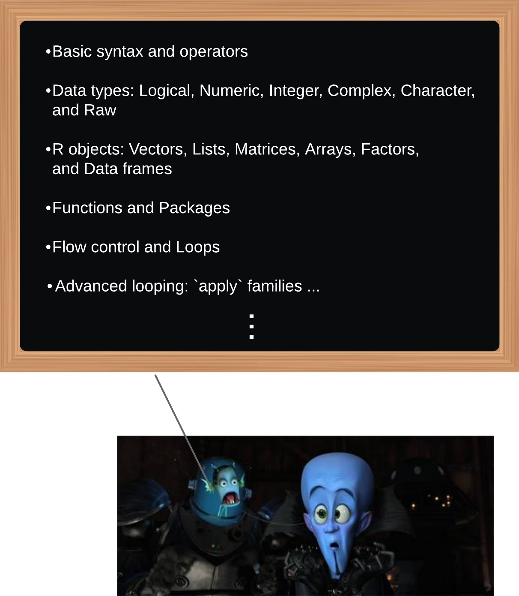

---- 

### Welcome everyone!

----

## BCB Programming Workshops

 

The annual programming workshops hosted by BCB-GSO intend to introduce programming basics to students. In this workshop, we will go through R basics in two hours. 

 

## Plan of Study

 

<!---this is an html comment that works in Markdown --->

How you start with a new language is probably learning its fundamentals as below:   

 

{width=150%}

  

There are a lot of good and free resources online that can guide you through this language learning process of R. Give it 20 to 30 minutes per day, you will get this language in just several months or even weeks! I listed some resources in the "More resources" section that may be helpful. Have fun!   

In today's workshop, we will 

- first walk through several very basic points from the first 4 categories shown on the "blackboard" above

- from there, we will learn how to explore, wrangle and visualize (if there's enough time) your data with R 

Notice that we may not have enough time to talk about all the "R basics" in this workshop. But I hope that you could have an idea about where and how to start learning more about R, and how to use R on your data. The blue note boxes (as shown below) in the **Tutorial** will normally tell you about the related important R basic knowledge that you may self educate yourself at later. Some online learning resources may be included in the box. Hope it can be helpful for you! 

**NOTE**

Hello, I am the blue box :)

 

## Contact  

 

You can send questions and feedback to liu2040@iastate.edu.

**Jia Liu**    
PhD Student | Bioinformatics and Computational Biology   
Iowa State University, Ames, IA
