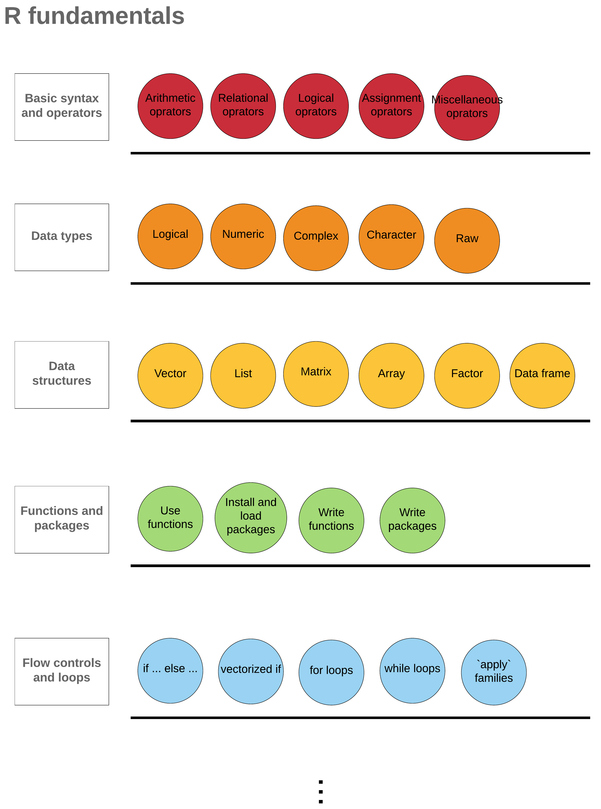

---- 

### Welcome everyone!

----

## BCB Programming Workshops

 

The annual programming workshops hosted by Bioinformatics and Computational Biology - Graduate Student Organization intend to introduce programming basics to students. This website has tutorials for R Basic and Advanced workshops. 

 

## Why R

 

A great tool for data analysis, modeling, and visualization! 

 

## Introduction to R Basic workshop

 

<!---this is an html comment that works in Markdown --->

Learning a new language is cool! But learning the basic stuff of a language can sometimes be just **a little bit** boring (Oops). While typing `print("Hello World")` or some small basic chunks, we probably think: why am I learning this thing? where am I in the big R knowledge field? when can I do fancy things?     

In this tutorial, I will try to give you a big picture of R. 

 

{width=100%}

  

The picture above shows the main categories of basic R and today we will try to go through some important elements of the first 4 categories. Imagine we have one thread for each category, and the elements in that category are the beads. In this tutorial, we will string one or more beads on each of the first four threads together, and the rest beads are for you to string after the tutorial. I will try to suggest some online resources for self educating in the blue summary boxes (as shown below) on R basic tutorial page. 

**NOTE**

Hello, I am the blue box :)

 

## Contact  

 

You can send questions and feedback to liu2040@iastate.edu.

**Jia Liu**    
PhD Student | Bioinformatics and Computational Biology   
Iowa State University, Ames, IA
