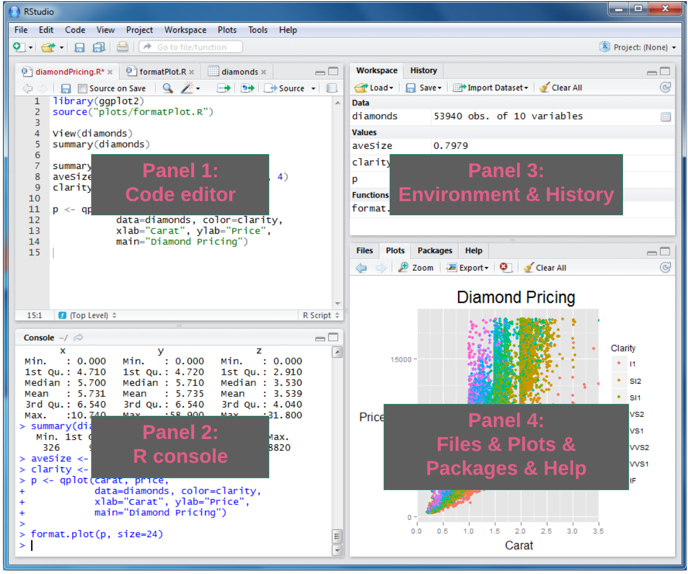

---- 

Author: Jia Liu    

Date: 03/26/2021

----

<br>

# Get familiar with Rstudio

<br>

## About Rstudio

<br>

Let's assume that you have R and Rstudio installed on your computer, and you have downloaded the GitHub Repository of [this workshop](https://github.com/jialiu232/2021_Spring_R_Basic_Workshop).    

Please do the following steps to open the workshop R package in your Rstudio:

- **Navigate** to the downloaded "2021_Spring_R_Basic_Workshop" directory on your computer

- **Right click** on the file "2021_Spring_R_Basic_Workshop.Rproj" > **Open With** > **RStudio**

<br>


A general Rstudio interface may look like this:   

<br>

{width=100%}


<br>

- Panel 1: create and edit your R script, R markdown, or other files. (To create a new file: **File** > **New File** > select the type of file of interest)    

- Panel 2: typing R commands

- Panel 3: check the R objects or variables you've created in **Environment**, and the previous R commands in **History**

- Panel 4: **Files** list the files in your working directory; **Plots** show the plots you created; **Packages** show the available external R packages


<br>


## Get and set working directory

You can know where your current working directory is by:

```{r}
getwd()
```


You can set your working directory to your preferred folder by: 

- an R command:

  - For mac and linux: `setwd("path/to/your/folder")`
  
  - For windows, your command might be: `setwd("C:/Users/path/to/working/directory")`


- clicking **Session** > **Set Working Directory** > **Choose Directory ...**

<br>


# <font color="orange">Data types</font> and <font color="red">Operators</font> 

<br>


## <font color="orange">Numeric</font>

Numeric values may look like $200$ or $3.8$. Integer and double (floating point numbers) are two most common numerical types. 

**1. Create a numerical variable**

You can create a variable with a numerical value by `=` or `<-`:

```{r}
a = 10
print(a)
```

Let's create a variable `b` with a double typed value this time:

```{r}
b <- 8.4
print(b)

c <- b + 2
print(c)
```


**2. Do arithmetic operations on numerical variables**

Arithmetic operators in R works as the normal mathematic operators and follow the order of operations/calculations.  

```{r}
20 * 4 + 1
```

Just as in mathematics operations, parentheses `()` can be used to change the order of operations.

```{r}
20 * (4 + 1)
```

<br>

><font color="red">Arithmetic operators</font>:

```{r table2, echo=FALSE, message=FALSE, warnings=FALSE, results='asis'}
library(knitr)
mathematics <- c("a + b", "a - b", "a $\\times$ b", "a $\\div$ b", "a $\\%$ b", "$a ^ b$")
arithmetic <- c("a + b", "a - b", "a * b", "a / b", "a %% b", "a ^ b")
descriptions <- c("a plus b", "a minus b", "a multiply b", "a divided by b", "remainder of a divided by b", "a raised to the bth power")
df <- data.frame(mathematics, arithmetic, descriptions)
colnames(df) <- c("Mathematics operators", "R arithmetic operators", "Descriptions")
x_html <- kable(df, escape = F, "html")
kableExtra::kable_styling(
  x_html,
  protect_latex = TRUE
)
```

----


><font color="red">Assignment operators</font>:

We used `=` and `<-` to assign values to variables. They seem to work similar, but there are some slight differences. In general, `<-` is more often used when assigning a value to a variable. We can assign value (does not have to be numerical value) to variable with assignment operator `<-`:

```{r}
x <- "8"
print(x)
```


Shortcut for assignment operator:

- In Windows: `Alt` + `-`   
- In Mac: `Option` + `-`


See [more](https://support.rstudio.com/hc/en-us/articles/200711853-Keyboard-Shortcuts) keyboard shortcuts for Rstudio. 


----

<br>


## <font color="orange">Character</font>

Some examples of Character type can be: 'this', "me", "29.9", 'FALSE'. The `x` variable we just created is a character variable. How do I know that?

**1. Check the type of a variable**

We can check the type of a variable with `typeof()` function:

```{r}
print(x)
typeof(x)
```

Normally, a value within two single quotes or double quotes (`'char'` or `"I am a character"`) has type of character.


**2. Concatenate multiple characters**

What if I want to concatenate two characters? Let's try the `+` operator: 

```{r, error=TRUE}
x + "is my lucky number."
```

It seems that the `+` operator does not work for character type. There is a function `paste` that concatenate characters:

```{r}
paste(x, "is my lucky number.")
```


**3. Change data type of a variable**

x has value "8" and **character** type, I guess we cannot do mathematics operations on it based on our experience:

```{r, error=TRUE}
x + 2
```


Then what if we change its type to **numeric** so that we can do arithmetic operation on `x`? `as.numeric()` function will do that: 

```{r}
y <- as.numeric(x)
print(y)
typeof(y)
```

`as.datatype()` functions can change the data type of a variable or value, for example, we can use `as.character()` to change other types of values to character. 

```{r}
as.character(y)
```


<style>
div.Tip0, div.Tip1, div.Tip2, div.Tip3, div.Tip4 {
  padding: 1em;
  margin: 1em 0;
  padding-left: 100px;
  background-size: 70px;
  background-repeat: no-repeat;
  background-position: 15px center;
  min-height: 120px;
  color: #1f5386;
  background-color: #bed3ec;
  border: solid 5px #dfedff;
  background-image: url("images/lightbulb.jpg")
}
</style>

----

<div class = "Tip0">

**SUMMARY**

We just went through two basic data types (numeric and character) and two operators (arithmetic and assignment). There are more useful data types and operators that we may or may not go through in the next. See more resources about [data types](https://swcarpentry.github.io/r-novice-inflammation/13-supp-data-structures/) and [operators](https://www.geeksforgeeks.org/r-operators/#Assignment%20Operators).


</div>

<br>

### <font color="orange">Exercise</font>

- A is a circle with radius $r = 3$. Calculate the area of A and store the result in variable `area_A`. (**Hint**: $\pi$ value is a built-in value in R, and it is stored in variable `pi`)

- You can see that the data type of `area_A` is "double" by `typeof(area_A)`. Change the type of `area_A` to "character".


<br>

Solution:

- `area_A <- pi * 3^2`
- `area_A <- as.character(area_A)`

<br>


# <font color="darkgoldenrod">Data structure</font>

<br>

Some frequently used R-objects / data structures are: "Vectors", "Lists", "Matrices", "Arrays", "Factors", and "Data frames". 

<br>

## <font color="darkgoldenrod">Vector</font>

<br>

Vector is probably the most commonly used data structure in R.

**1. Create or add to a vector**

You can create a vector with `c()` function:

```{r}
nu <- c(1, 2, 3)
print(nu)
typeof(nu)
```

Not just numeric vectors, you can also create a character vector:

```{r}
ch <- c("hi", "what's up", "hey")
print(ch)
typeof(ch)
```

or logical vector:

```{r}
lo <- c(TRUE, FALSE, T)
print(lo)
typeof(lo)
```

>Logical is another data type in R. Its value can be: `TRUE`, `T`, `FALSE`, `F`. Logical type is case sensitive. `false` is not a logical type.

<br>

`c()` can also be used to add elements to existing vectors:

```{r}
nu <- c(nu, 100, 808)
print(nu)
```

or 

```{r}
ch <- c("hello", ch)
print(ch)
```


There are many other ways to create vectors, such as:

```{r}
z <- 1:10
print(z)
```


**2. Operate on vectors**

Do arithmetic operations on vectors:

```{r}
ve <- c(2, 4, 3)
ve / 2
ve + c(1, 2, 3)
```


Apply some other functions to a vector:

```{r}
print(ch)
paste(ch, "there")
```

Get the length of a vector using `length()` function:

```{r}
length(ch)
```


----

<div class = "Tip1">

**SUMMARY**

1. About `vector`:

- Vectors are in one dimensional
- All the elements within one vector needs to be of the same data type
- The operation that is applied to a vector will be applied to each element

2. `matrix` can be described as an extension of `vector` from one dimensional to two dimensional. `matrix` is rectangular data and the elements within a matrix need to be of the same type.

3. `Array` is similar as `matrix`, but can be in more dimensions.

Learn [more](https://www.oreilly.com/library/view/learning-r/9781449357160/ch04.html) here. 

</div>


<br>

### <font color="darkgoldenrod">Exercise</font>

- Assign `c(15, 256, 11)` to variable `num`   
- Check if each number in `num` is odd    

<br>

Solution:

- `num <- c(15, 256, 11)`
- `num %% 2`


<br>

## <font color="darkgoldenrod">List</font> 

<br>

The "vector - matrix - array" data structure series are awesome, but they contain elements with only the same data type. Now we will learn about **"list"**, where one list can contain elements in different data types, including lists:

```{r}
li <- list(TRUE, 28, "haha", F)
li
```

Get the number of elements in a list by `length` again:

```{r}
length(li)
```

<br>

## <font color="darkgoldenrod">Data frame</font> 

<br>

Consider data frame as a list of vectors with equal length. Different vector can have different data type.

Create a data frame by `data.frame` function:

```{r}
animal <- c("cat", "zebra", "turtle", "chicken")
leg <- c(4, 4, 4, 2)
mammal <- c(TRUE, TRUE, FALSE, FALSE)
df <- data.frame(animal, leg, mammal)
df
```

----

A lot of data set that you will be working with in R are probably of data frame type. R provides some built-in data set that you can play with. List the pre-loaded data set by `data()`: 

```{r}
data()
```

`mtcars` is a data set comprises 11 aspects of automobile information for 32 automobiles. Load the `mtcars`:

```{r}
# loading
data("mtcars")
```

----

The following commands will give us a very basic description about the data frame:

While `typeof()` tells the internal data type or storage mode of an object (lower level), `class()` returns the classes of the object (higher level):
```{r}
typeof(mtcars)
class(mtcars)
```


We can check the first several rows of a data frame by:
```{r}
head(mtcars)
```

or the last several rows of a dataframe by:

```{r}
tail(mtcars)
```

or the dimension of a data frame by:

```{r}
dim(mtcars)
nrow(mtcars)
ncol(mtcars)
```

or the names attribute for a data frame by:

```{r}
names(mtcars)
colnames(mtcars)
```


some data sets may also have row names:

```{r}
rownames(mtcars)
```

----


<br>

## <font color="darkgoldenrod">Accessing elements in a data structure</font> 

<br>

**1. Accessing elements in a vector using `[index]` or `[index_start : index_end]`**

```{r}
z <- c(100, 200, 300, 400)
z
# access the third element in z
z[3]
# access the second to forth elements in z
z[2:4]
```


<br>


**2. Accessing elements in a data frame**


- Get specific columns: 

You can get a specific column of a dataframe by df_name$colume_name`:
```{r, eval=FALSE}
mtcars$mpg
```


- Accessing elements with `df_name[r_index, c_index]`
  
  - `r_index`/`c_index` can be row/column numbers or ranges. For example, get the element at row 3, column 6:
  
```{r}
mtcars[3, 6]
```

If you want to get specific row(s), then specify the row number(s) and leave the column part empty, `df_name[r_index, ]`. For example, you can get the first three rows by:
```{r, eval=FALSE}
# return the first 3 rows
mtcars[1:3, ]
```


If you just want to select specific column(s), then leave the row index empty, `df_name[ , c_index]`. Here you can get the column 4 to 8 by:
```{r, eval=FALSE}
# return the last 5 columns
head(mtcars[ , 4:8])
```

  - `c_index` can be column names.
  
```{r, eval=FALSE}
mtcars[ , c("mpg", "gear")]
```
    
  - `r_index` can be relational operator 
  
We can get the rows of `mtcars` with `mpg` columns bigger than $20$:

```{r, eval=FALSE}
mtcars[mtcars$mpg > 20, ]
```

Or we may only be interested in rows that `gear` equals to 4:

```{r, eval=FALSE}
mtcars[mtcars$gear == 4, ]
```

The symbol `>` and `==` we used above are so called "relational operator". Normally a relational operator will return a logical type (TRUE / FALSE) based on the relationship between its left and right side. Then the outer part of the code, if there's any, will decide what to do based on the logical type.

----

><font color="red">Relational operator</font>

- `==`: checks if the left side values equal to that of the right side. So in the example above, for each row, if its `Pollutant` value is "CO2", the row will be filtered as one of the output. 
- `>`: greater than 
- `<`:less than
- `<=`: less than or equal to
- `>=`: greater than or equal to
- `!=`: unequal to 

----


What about if I am interested with the data of both `mtcars$mpg > 20` and `mtcars$gear == 4`?

You can include both two conditions with `&` (**AND**):

```{r, eval=FALSE}
mtcars[mtcars$mpg > 20 & mtcars$gear == 4, ]
```


The `|` (**OR**) operator returns true if its left side or right side is true. For example, we can get all the rows of `cyl` equals to $6$ or $8$ by:

```{r, eval=FALSE}
mtcars[mtcars$cyl == 6 | mtcars$cyl == 8, ]
```

The `&` and `|` we just saw are two logical operators.

----

><font color="red">Logical operator</font>

- `!x`: NOT x
- `x | y`: x OR y
- `x & y`: x AND y

----

  
<div class = "Tip3">

**SUMMARY**

R's basic subsetting is powerful. It allows you to adopt different methods, such as relational and logical operators to extract the useful information from a data set. I am including some good online resources here about subsetting: [Everything I know about R subsetting](https://hughjonesd.github.io/subsetting.html), and [subsetting in the book *Advanced R*](https://adv-r.hadley.nz/subsetting.html).   

There are other useful packages and functions to subset data frames, for example `tidyverse`. You will learn more about it in the R advanced workshop.


</div>


<br>

### <font color="darkgoldenrod">Exercise</font>

- Get the rows of which `cyl` equals to $4$ and `hp` column bigger or equal to $110$ from `mtcars` data frame

<br>

Solution: 

```{r}
mtcars[mtcars$cyl == 4 & mtcars$hp >= 110, ]
```


<br>


# <font color="olivedrab">Functions and Packages</font> 

<br>

## <font color="olivedrab">Functions</font> 

The base R has many useful built-in functions that maybe helpful to your data. The normal syntax of using a function is as such: `function_name(argument 1, argument 2, ...)` 

- `print` can be used to display information

```{r}
h <- c(8, 2, 5.5)
print(h)
```

- `sort`: Order a vector in ascending or descending order.

```{r}
# function name: sort; argument: y
sort(h)
```

We just sorted a vector in ascending order, but how to do it in descending order? **How to get all the arguments info of a function and learn how to use a function?**

- Normally, you can find the detailed description, usage, and arguments information in the function/package R documentation. Search the R Documentation by `?function_name` or search R help files with a word or phrase by `??regresion`:

```{r}
?sort

# sort vector y in descending order
sort(h, decreasing = TRUE)

??regresion
```

- The second way is just to Google!

<br>

## <font color="olivedrab">Packages</font> 

Sometimes the functions you want to use may not be included in base R, but instead in a specific R package. That's when we need to install the package. 

`tidyverse` is a collection of R packages that is being widely used in data science area.

```{r, eval=FALSE}
# install the package
install.packages("tidyverse")

# load the add-on package
library(tidyverse)
```


<br>

There are a lot of existing functions and packages that may be helpful for your analysis. But if your work needs some very specific functions or the same chunk of code is reused multiple times, it's always a good idea to write your own functions or even packages!

<br>


## <font color="olivedrab">Create a function</font> 

The structure of a R function is as shown below:

```{r, error=TRUE}
function_name <- function(argument1, argument2, ... ) {
  statements
  return(object)
}
```


Here we will try to define a simple function `f_to_c` that converts temperatures from Fahrenheit to Celsius:

```{r}
f_to_c <- function(temp_in_F) {
  temp_in_C <- (temp_in_F - 32) * 5 / 9
  return(temp_in_C)
}
```


Now we can convert temperature in Fahrenheit to Celsius with `f_to_c`. For example, temperature of 100 in Fahrenheit is:

```{r}
f_to_c(100)
```


----

<div class = "Tip2">

**SUMMARY**

Now you probably have an idea about how to use functions, packages, and how to create a simple R function.       

See more resources of creating [functions](https://swcarpentry.github.io/r-novice-inflammation/02-func-R/) and 
[your own R package](http://web.mit.edu/insong/www/pdf/rpackage_instructions.pdf).

</div>


<br>

# Summary

<br>

Let's have a look at the "big picture" again:

{width=100%}
<br>

We put some beads onto several threads, and there is always more to self educate yourself about. Notice that you don't need to wait until being familiar with all the R basics to use R in your research or data analysis. You will keep learning and building your fundamentals while using R. Hope the R advanced workshop can give you some ideas about how to use R to explore your data. 

